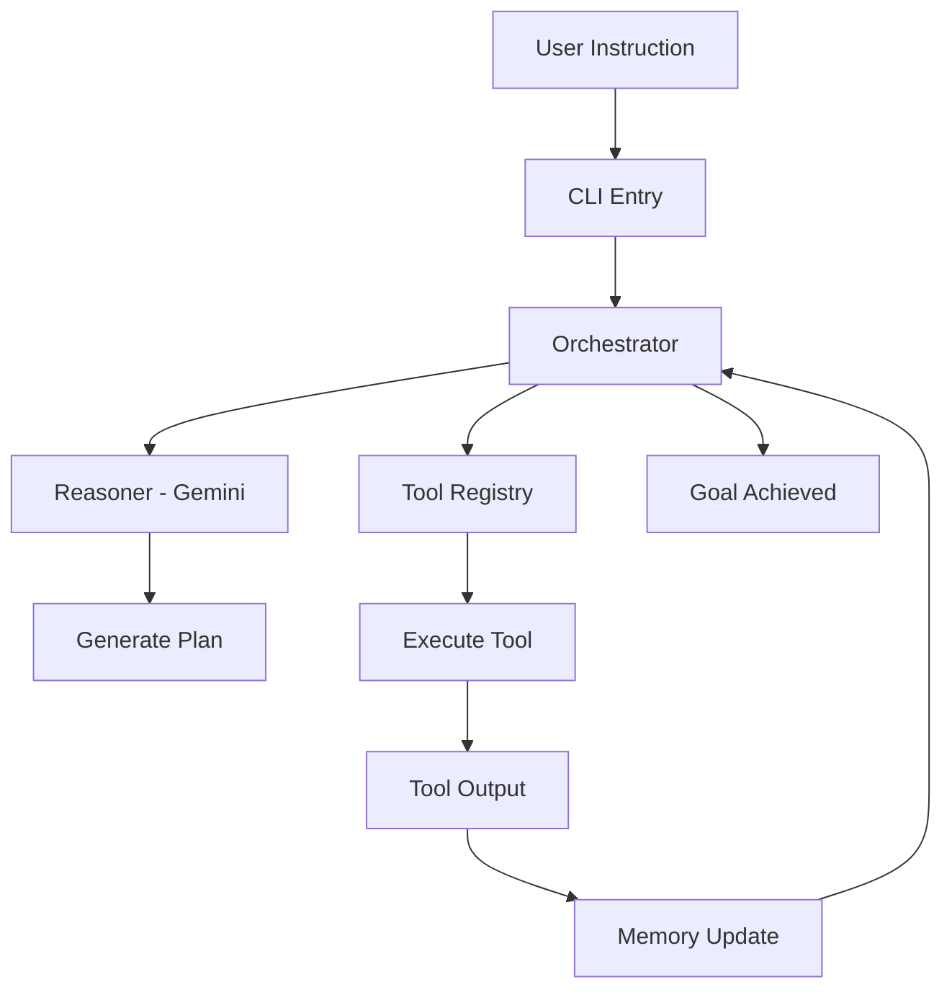

# Architecture — SyntaxNode

SyntaxNode is designed with a focus on modularity, scalability, and robust agentic reasoning.

## Core Components

### 1. Agent Orchestrator (`src/agent/orchestrator.ts`)
The brain of the system. it manages the lifecycle of a task through a continuous loop:
- **THINK**: The Reasoner analyzes the current state and decides the next logical step.
- **PLAN**: A structured list of sub-tasks is generated to provide transparency to the user.
- **TOOL**: The appropriate tool is selected and executed from the Registry.
- **OBSERVE**: The output of the tool is fed back into memory for the next cycle.

### 2. Reasoning Engine (`src/agent/reasoner.ts`)
Powered by Google Gemini, the Reasoner uses structured prompting to produce JSON responses that the Orchestrator can parse. It maintains a memory of previous thoughts and actions to ensure consistency.

### 3. Tool Registry (`src/tools/registry.ts`)
A centralized system for managing agent capabilities. Tools are registered with clear descriptions and parameter schemas, allowing the Reasoner to understand how to use them.
- **FS Tools**: Handle all file operations within a sandboxed `generated/` directory.
- **Shell Tools**: Allow for command execution (e.g., listing files, running build scripts).
- **Web Tools**: Specialized LLM-powered tools for generating semantic HTML and premium CSS.

### 4. Memory System (`src/agent/memory.ts`)
Stores the conversation history and the results of tool executions. This context is crucial for the iterative refinement of the generated output.

### 5. Premium Logger (`src/core/logger.ts`)
Ensures a high-quality CLI experience using:
- `ora` for real-time activity spinners.
- `chalk` for semantic color coding (Success, Error, Info, Step).
- `boxen` for high-level status headers.

## Data Flow

