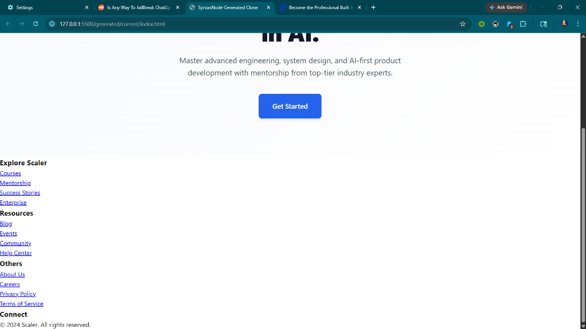

# SyntaxNode — AI Agent CLI

[](https://opensource.org/licenses/MIT)
[](https://www.typescriptlang.org/)
[](https://deepmind.google/technologies/gemini/)

**SyntaxNode** is a production-grade AI Agent CLI tool built for high-fidelity website cloning. Unlike generic code generators, SyntaxNode uses an iterative **Agent Loop** to analyze target structures and reproduce them with pixel-perfect accuracy.

---

## 📺 Demo Video

[](YOUR_YOUTUBE_LINK_HERE)

*A complete walkthrough of SyntaxNode autonomously cloning the Scaler Academy landing page.*

---

## 📸 Cloned Website Preview (scaler.com)


*High-fidelity runtime replay of the Scaler Academy homepage, featuring deterministic hydration and animation stabilization.*

---

## 🚀 Key Features

- **Autonomous Cloning Engine**: Specifically optimized for reproducing complex layouts like `scaler.com`.
- **Agentic Reasoning Loop**: Uses a **THINK -> PLAN -> GENERATE -> OBSERVE -> VERIFY** cycle.
- **Live Streaming Interface**: Real-time terminal logs provide transparency into the agent's "thought" process.
- **Auto-Open & Automation**: Automatically launches the browser and captures previews upon completion.
- **Production Architecture**: Built with TypeScript, Commander.js, and Google Gemini 2.5 Flash.

---

## 🛠 Architecture

SyntaxNode follows a modular, decoupled design:

- **Orchestrator**: Manages the iterative task loop and final automation.
- **Reasoner**: Leverages Gemini 2.5 Flash for structured planning and decision-making.
- **Tool Registry**: Centralized system for filesystem, shell, and specialized web tools.
- **Memory**: Persistent context for multi-step refinement cycles.

See [ARCHITECTURE.md](ARCHITECTURE.md) for deeper technical insights.

---

## 📦 Setup & Installation

1. **Clone the Repository**:
   ```bash
   git clone https://github.com/Spiritsfuse/SyntaxNode.git
   cd SyntaxNode
   ```

2. **Install Dependencies**:
   ```bash
   npm install
   ```

3. **Configure Environment**:
   ```bash
   cp .env.example .env
   # Add your GEMINI_API_KEY to .env
   ```

4. **Build the Project**:
   ```bash
   npm run build
   ```

---

## 🎮 Usage

### One-Command Clone
Run the master command to clone Scaler Academy autonomously:
```bash
npm run start clone
```

### Conversational Mode
Chat with the agent for custom instructions:
```bash
npm run start chat
```

---

## 📄 License

MIT License.
